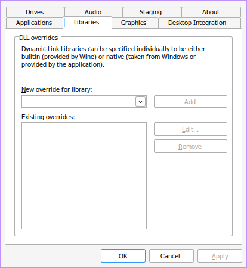
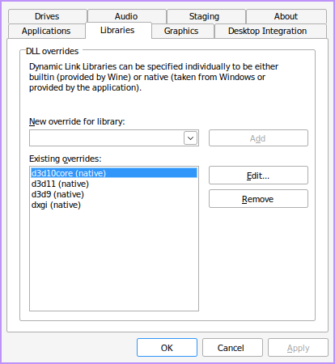

# SapphireLauncher-Linux
A shitty Linux launcher for for the [Sapphire project](https://github.com/SapphireServer/Sapphire).

## Usage
- Download the latest release from the [releases page](https://github.com/3e849f2e5c/SapphireLauncher-Linux/releases/latest).
- Set up a wine installation for the client. See [Wine setup](#wine-setup) section for more info.
- Configure the launcher via the config button in bottom right of the launcher.

The launcher will store your username and password in plain text in `config.xml` next to the executable. If you don't want to store your credentials, you can use the `--no-save-credentials` flag.

When credentials are stored, you can use the `--auto-login` flag to automatically login without initializing the GUI.

## Wine setup

### Prerequisites
- You will need some kind of version of wine. I recommend [wine-xiv](https://github.com/goatcorp/wine-xiv-git/releases/latest).
- For best performance you will need DXVK from [here](https://github.com/doitsujin/dxvk/releases/latest).

Download the relevant tarballs and extract them to a folder. To extract the tarballs, use the following commands:

```bash
tar -xvf wine-xiv-staging-fsync-git-<version>.tar.xz
tar -xvf dxvk-<version>.tar.gz
```

### Setting up wine

Extract the wine-xiv tarball to a folder. Something like `~/wine-xiv`. Then, extract the dxvk tarball to `~/wine-xiv/dxvk`. You should end up with a folder structure like this:

```
wine-xiv
├── dxvk
│   ├── x32
│   │   ├── d3d10core.dll
│   │   ├── d3d11.dll
│   │   ├── d3d9.dll
│   │   └── dxgi.dll
│   └── x64
│       ├── d3d10core.dll
│       ├── d3d11.dll
│       ├── d3d9.dll
│       └── dxgi.dll
└── wine-xiv-staging-fsync-git
    ├── bin
    │   ├── wine
    │   ├── wine64
    │   └── ... (other wine binaries)
    ├── include
    │   └── ... (wine headers)
    ├── lib
    │   └── ... (64-bit libraries)
    ├── lib32
    │   └── ... (32-bit libraries)
    └── share
        └── ... (other wine files)
```

### Setting up the DXVK and creating a wine prefix

Choose a wine prefix for the game. Something like `~/.wineprefix_xiv`. then run the following command:

```bash
WINEPREFIX=~/.wineprefix_xiv WINEARCH=win64 ~/wine-xiv/wine-xiv-staging-fsync-git/bin/wine64 winecfg 
```

A popup should appear, select the "Libraries" tab:



Under "New override for library" enter `d3d10core` and press Add. Repeat this for `d3d11`,`d3d9` and `dxgi`.
Then select them under "Existing overrides" and press "Edit". In the popup, change it to `Native (Windows)` and press "OK". Repeat this for all 4 libraries until everything ends with `(native)` in the list.



Press "OK" to save and close the popup.

Running winecfg should have populated the wine prefix with some files now. Copy the contents of `~/wine-xiv/dxvk/x64` to `~/.wineprefix_xiv/drive_c/windows/system32/`, replacing any existing files.

## Post-installation
After configuring the launcher and running the game you might encounter an issue where after pressing start in the main menu the game will be stuck on a black screen. This is because the game is trying to play the opening cutscene, but it's not working because it's using a proprietary video format.

A simple fix for this is to head over to
`~/.wineprefix_xiv/drive_c/users/$USER/Documents/My Games/FINAL FANTASY XIV - A Realm Reborn/` folder and finding the `FFXIV_BOOT.cfg` file. Open it in a text editor and change the `CutsceneMovieOpening` value to `1` to prevent the game from playing the opening cutscene. 

Save the file and try running the game again.
